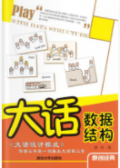

## 一些技术书籍练习源码

> 请将项目放到 `$GOPATH/src/`文件夹下

### 问题

+ cannot resolve directory

如果在 ide 中出现 `cannot resolve directory`问题，可[参考](https://blog.csdn.net/weixin_44024220/article/details/105960432) 解决。

### dev 目录

一些开发测试的代码。

### leetcode

刷 leetcode 的代码

### 许式伟 《go语言编程》

#### 源代码文件

`xsw-yybc`

#### 个人简评

书虽然有点老，但是思想却一点都不老，对于知识点的讲解很透彻，是一本难得的好书，非常值得一读。

书中的例子有一些跑不起来，把这些例子改的可以运行也是很有成就感的，一方面是练习，一方面也可以加深 对书中知识点的理解。

### 雨痕 《go 语言学习笔记》

#### 源代码文件

`yh-xxbi`

#### 个人简评

上卷读的起来还不费劲，可以理解语言的相关功能的使用方法和注意事项，下卷读起来有点费力，涉及到了编译和计算机底层的一些问题，需要懂一些编译原理。

### 谢孟君 《go web编程》

#### 源代码文件

`xmj-goweb`

### 程杰 《大话数据结构》

#### 源文件代码

`dhsjjg`

